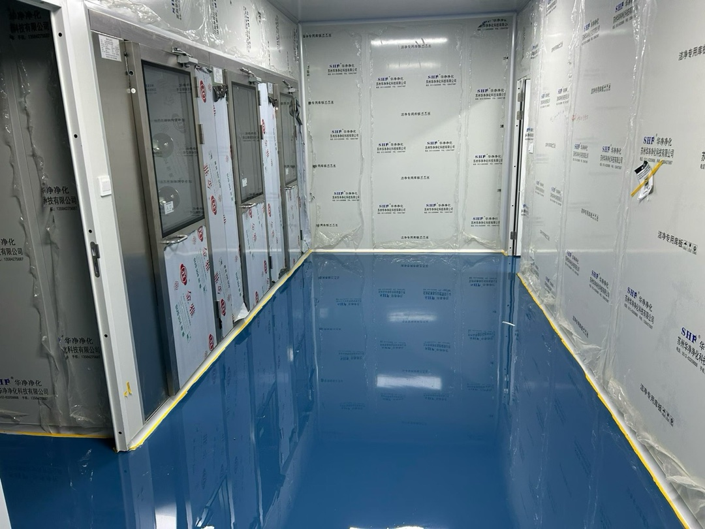
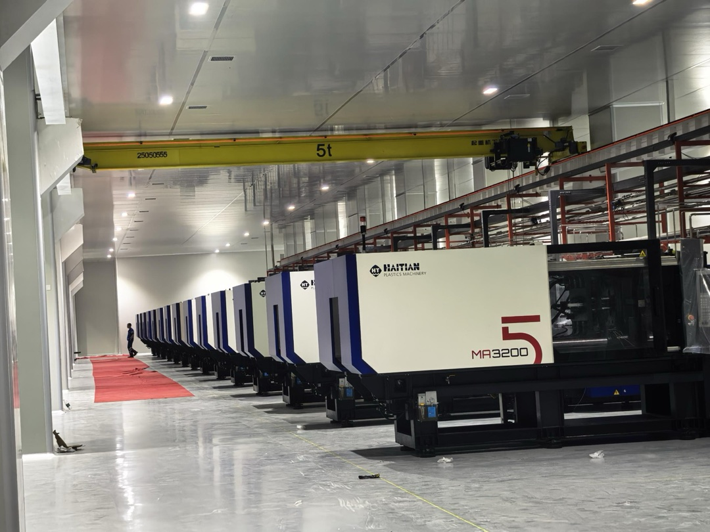

# 美集微信订阅号图文稿

## 后台字段

标题：把TOP精神写进每一天｜致美集全员的一封信

作者：MEGEE 美集

摘要：端午安康。写给每一位正在新工厂、项目现场、客户一线和管理岗位上共同前行的美集人：让诚信成为底线，让超越成为习惯，让完美成为持续迭代的方向。

封面图：`articles/megee-top-spirit-wechat-assets/cover-megee-top-spirit.jpg`

原文链接：建议暂不填写，正文已完整呈现。若需要放链接，等 `novora.cc` 稳定后再填 `https://novora.cc/articles/2026-06-18-megee-top-spirit.html`。

## 正文

亲爱的美集同仁：

端午安康。

这封信写在一个忙碌、紧绷，也值得被认真记住的阶段。新工厂的设备正在进场，现场的管线、洁净空间、注塑设备、项目节点和客户要求，都在同时推进。每个人都在自己的位置上托住这件事。

我们想对大家说一声谢谢。谢谢一线同事在现场反复确认标准，谢谢项目团队在节点之间协调资源，谢谢业务与客户团队在压力中保持沟通，谢谢职能与管理团队把看不见的事务一件件落下去。

美集向前，不是靠某一个人的冲锋，而是靠一群人把复杂的事情持续做准。

越是在这样的时期，我们越需要回到共同的做事方式。

TOP 精神不是一句口号，它是美集面对客户、产品、现场和团队时的基本选择：

Trusting，诚信。

Outperforming，超越。

Perfecting，完美。

三个词合在一起，就是我们希望自己每天都能做到的样子。

TOP 的价值，不在于把词语说得更响亮，而在于把日常做得更可靠。它要求我们在看得见与看不见的地方保持一致：说到做到，及时反馈，持续改善，认真对待每一个细节。

## Trusting：让信任有形

一家企业会被客户记住，常常不是因为某一次漂亮表达，而是因为很多次小事累计出的稳定感。

项目推进是否透明，问题出现是否承担，质量标准是否可追溯，产品细节是否反复打磨，这些日常选择，最终构成企业真正的可信度。

诚信不是姿态，而是可被验证的稳定行为。它体现在承诺之前的审慎，也体现在承诺之后的兑现；体现在顺利时不夸大，也体现在困难时不回避。

对客户，我们真实沟通进度、风险与边界，让合作建立在清楚的信息之上。

对产品，我们把质量问题放在台面上处理，而不是让问题被流程噪声掩盖。

对团队，我们让信任从一次次守约、交付和复盘中生长出来。

## Outperforming：让标准前进

今天的新工厂，不只是厂房、设备和产能的升级。它也在提醒我们：当空间变大、团队变大、客户期待变高，原来的经验必须沉淀成标准，个人的努力必须转化为组织的能力，临时解决问题的方式必须升级为可复制的方法。

超越不是向外部证明什么，而是不断向内部追问：还能不能再好一点。

在产品开发中，把“可用”继续推进到“更顺手、更稳定、更符合体验”。

在流程管理中，把一次修正沉淀成方法，减少下一次重复犯错。

在组织成长中，让每个人都保留继续学习和主动改善的空间。

完成任务只是起点，把流程理顺一点，把响应提前一点，把沟通讲清楚一点，把产品细节再优化一点，才是美集持续成长的方式。

## Perfecting：让细节发光

完美不是一次抵达，而是在每一次复盘、确认、修正里，把产品和组织都磨得更清晰。

真正的完美主义并不等待所有条件成熟，它从不够完美的行动开始，再用一次次检查、调整和复盘把理想磨得更清晰。

我们做的是美妆包装，客户最终触摸到的，往往就是那些被我们认真处理过的边角、结构、手感、色泽和稳定性。

所以，完美首先是尊重细节。因为客户最终接触到的，常常就是那些被认真处理过的细节。

完美也是尊重时间。好的产品和可靠关系，都需要被耐心打磨。

完美更是尊重迭代。把改进视为常态，而不是某次危机后的临时动作。

## 把品牌写进做事方式

所以 TOP 更像一份内部约定：

让诚信成为协作的底线，让超越成为成长的方向，让完美成为持续迭代的动力。

它不是要求大家永远不出错，而是要求我们在面对问题时不遮掩，在面对挑战时不后退，在面对细节时不轻慢。

接下来的路不会轻松。新工厂要进入更完整的运行状态，新项目要交付，客户标准会继续提高，组织协作也会经历新的磨合。

但越是在复杂的时候，我们越要用简单、明确、可执行的原则彼此校准：

讲真话，守承诺；

不满足，继续改；

重细节，重标准。

愿我们在忙碌中不丢掉秩序，在压力中不丢掉诚实，在追赶中不丢掉对质量的敬畏。

也愿每一位美集人都知道：你今天认真做好的那一件小事，都会成为美集明天被信任的理由。

粽叶有清香，艾草有长意。

愿每一位美集同仁在忙碌之后，也能拥有一段安稳、清爽、被好好照顾的假期。

祝大家端午安康。

归来继续带着诚实、主动和认真，把美集的每一天做得更好。

美集 MEGEE

2026年6月18日

